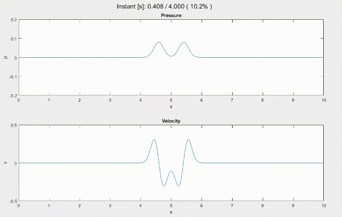

  

# WASAbi 1D

One-dimensional Matlab implementation of WASAbi, a Wave-based Acoustic Simulation Algorithm.

## Features

- FDTD method
- Fourier method
- Rectangular Domain Decomposition (RDD)
- Different spatial orders for FDTD and residual
- Test cases included
- Air absorption
- Different test scripts (convergence test, dissipation/dispersion test, domain decomposition test)

## Screenshots

## Installation

Clone this repository and run it with Matlab.

## Roadmap

- Implement PML subdomains
- Implement Adaptive Rectangular Decomposition (ARD)

## Authors

- [@mazamin7](https://www.github.com/mazamin7)

